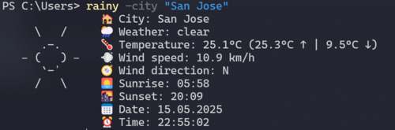

# Rainy 🌦️

Neofetch-like, minimalistic, and customizable weather-fetching cli tool for your current location on Linux and Windows.
## Showcase
#### Linux


#### Windows



## Dependencies

* `python`
* `python3-requests`
* `python3-emoji`
* `python3-termcolor`
* `make`

You can install all of them from your distribution repositories using your package manager supplied by your distribution.

#### 🐧 Debian/Ubuntu

```bash
sudo apt update -y && sudo apt install -y python3 python3-requests python3-emoji python3-termcolor make
```

#### Windows

This is only needed if you don't use the executable

```powershell
winget install git.git
winget install Python.Python.3.12
```

## Installation

### Linux

To install rainy run the following command:

```commandline
git clone https://github.com/HuckleberryLovesYou/rainy.git && cd ./rainy && sudo make install && rainy
```

To configure, edit the Config-File at `/usr/local/bin/rainy.conf.ini`.
After this you can just type `rainy` to execute it.
To uninstall rainy, you can run `make uninstall` in the cloned repository.

### Windows

If you don't want to be able to configure rainy, you can download the latest executable from the GitHub releases and add it to your PATH environment variable.
Now, reopen any terminals you have currently opened, and type `rainy` in your terminal.

If you want to **configure** it, you will have to clone the Repository:

```powershell
git clone https://github.com/HuckleberryLovesYou/rainy.git
cd .\rainy
py.exe -m pip install -r .\requirements.txt
```

Now, add the folder called `rainy`, in which the `rainy.bat` file is located to your PATH environment variable like shown [here](https://stackoverflow.com/a/44272417/27739226).
To configure rainy, edit the Configuration at `.\rainy\src\rainy.conf.ini`.
Reopen any terminals you have currently opened, and then type `rainy` in your terminal to execute it.

## Configuration

* You can edit the config at the **top** of `/usr/local/bin/rainy` (or .\rainy\src\rainy.py on windows) and set unit of measurements, date formats.
* You can also set to show city name or/and the current date and time if you want to.

#### temperature_unit

Here you can specify what unit of measurement you would like to use for the temperature.
You can choose between °C (Celsius), °F (Fahrenheit) and °K (Kelvin).
Every temperature is rounded to one decimal place.
Default: °C

#### wind_speed_unit

Here you can specify what unit of measurement you would like to use for the speed of wind.
You can choose between mph (Miles per Hour), km/h (Kilometre per Hour), m/s (Meter per Second) and Knots.
Every wind speed is rounded to one decimal place.
Default: km/h

#### show_city

This enables or disables the display of the city that was fetched by your location using your public IP Address.
If you use a VPN Rainy will not get the weather for the right location, but rather get the weather at the location of your VPN exit node.
Default: True

#### show_date

This enables or disables the display of the current date.
The format of the display date can be changed at `date_format`.
Default: True

#### date_format

Here you can specify the format of the current date you would like to use.
You can choose between MM/DD/YYYY, DD/MM/YYYY, YYYY/MM/DD, YYYY-MM-DD and DD.MM.YYYY.
This has no effect if show_date is False.
Default: DD.MM.YYYY

#### show_time

This enables or disables the display of the current time.
Currently, there is no way of changing the format of the time.
Default: True

## Update

What if there's an update?
You can just update your local repository with running `git pull` in the cloned folder. After that run `sudo make install`.

### Fork

This is a fork of a smaller project by [Rainy by loefey](https://github.com/loefey/rainy).
Upstream is unmaintained. He has rewritten and upgraded it in Rust, creating [Thundery](https://github.com/loefey/thundery).

Icon used for executable in releases: https://www.flaticon.com/free-icons/rain